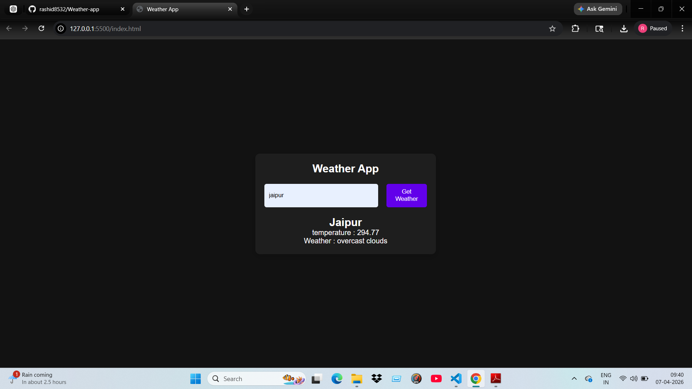

# 🌦️ Weather App

A simple and responsive Weather Application that shows real-time weather data using an API.

---

## 🚀 Features

- 🌍 Search weather by city name  
- 🌡️ Displays temperature, humidity, and weather condition  
- ⛅ Dynamic weather updates  
- 📱 Responsive design (works on mobile & desktop)

---

## 🛠️ Tech Stack

- HTML  
- CSS  
- JavaScript  
- Weather API (like OpenWeatherMap)

---

## 📸 Screenshot




## ⚙️ How to Run Locally

1. Clone the repository  
```bash
git clone https://github.com/rashid8532/Weather-app.git
